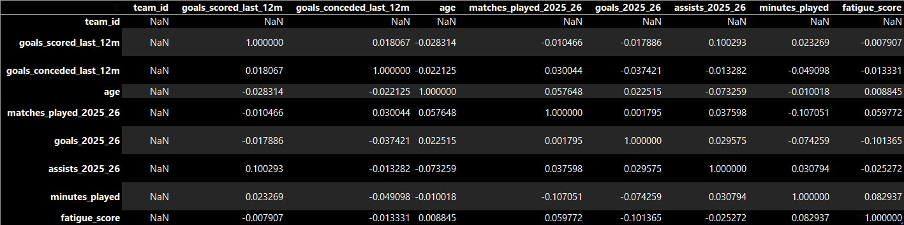

# About Dataset
# FIFA World Cup 2026: Players + Matches Dataset
**Comprehensive dataset for FIFA World Cup 2026 containing:** rich player statistics, match schedules, venues, and external factors.

# Data Scource
https://www.kaggle.com/datasets/yogeshm01/fifa-world-cup-2026-players-matches-dataset/data

# 📊 What’s Inside Original Dataset
teams.csv — Team rankings, squad details, form (48 teams)
players.csv — Detailed player profiles, performance metrics, injury risk, market value (10K+ rows)
matches.csv — Match schedule, results, xG, predictions
venues.csv — Host stadiums with capacity and weather info
external_factors.csv — Weather, social sentiment, fatigue, betting odds

# 🎯 Merged Dataset 1 for Linear Regression Model

**Merged dataset 1 - Team and Players**
**RangeIndex:** 19200 entries, 0 to 19199
**Data columns** Total 15 columns

 #   Column                   Non-Null Count  Dtype  
---  ------                   --------------  -----  
 0   team_id                  0 non-null      float64
 1   team_name                19200 non-null  str    
 2   recent_form              19200 non-null  str    
 3   goals_scored_last_12m    19200 non-null  float64
 4   goals_conceded_last_12m  19200 non-null  float64
 5   player_id                19200 non-null  str    
 6   player_name              19200 non-null  str    
 7   position                 19200 non-null  str    
 8   age                      19200 non-null  int64  
 9   matches_played_2025_26   19200 non-null  float64
 10  goals_2025_26            19200 non-null  float64
 11  assists_2025_26          19200 non-null  float64
 12  minutes_played           19200 non-null  float64
 13  injury_risk              19200 non-null  str    
 14  fatigue_score            19200 non-null  float64

**dtypes:** 
- float64(8)
- int64(1) 
- str(6)

**memory usage:** 2.2 MB

# 🎯 Merged Dataset 2 for Linear Regression Model

**Merged dataset 2 - Matches, Venue, External Factors**
**RangeIndex:** 800 entries, 0 to 799
**Data columns:** Total 18 columns

 #   Column                   Non-Null Count  Dtype  
---  ------                   --------------  -----  
 0   match_id                 800 non-null    str    
 1   date                     800 non-null    str    
 2   team_home                800 non-null    str    
 3   team_away                800 non-null    str    
 4   venue_id                 800 non-null    str    
 5   group_stage              800 non-null    str    
 6   predicted_win_prob_home  800 non-null    float64
 7   goals_home               800 non-null    int64  
 8   goals_away               800 non-null    int64  
 9   venue_name               800 non-null    str    
 10  city                     800 non-null    str    
 11  country                  800 non-null    str    
 12  avg_temperature          800 non-null    float64
 13  humidity                 800 non-null    int64  
 14  pitch_quality_score      800 non-null    float64
 15  travel_distance_km       800 non-null    int64  
 16  weather_condition        800 non-null    str    
 17  temperature              800 non-null    float64

**dtypes:** 
- float64(4)
- int64(4)
- str(10)

**memory usage:** 112.6 KB

# 📌 Correlation Features

**Dataset:** Team & Players

**Dataset:** Match Merge

Danielle Whitney ⚽