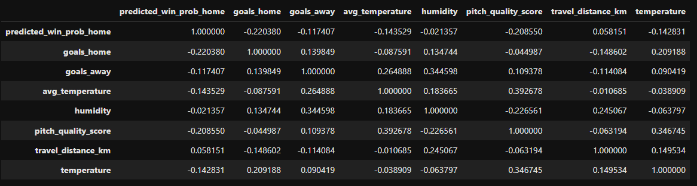

#  HIT140 Assessment 2 – Foundations of Data Science - Charles Darwin University - September 2026 

## Group 23: 
- Danielle S407528
- Gabrielle S375255
- Judith S395778
- Manuela S320756

# 📌 Project Overview - FIFA World Cup Analysis ⚽
This project investigates the FIFA World Cup 2026 data.

## Objective 1:
Perform four (4) distinct analytic tasks that analyse the FIFA World Cup 2026 statistics using Python.

Each analytic task must be driven by a distinct question that will be answered using all the following skills:
* Analytic question formulation
* Data wrangling
* Data preparation and sampling
* Descriptive statistics
* Inferential statistics (Confidence interval)
* Inferential statistics (Two-sample t-Test)

Each analytic task must also have a distinct focal point of investigation that differs from the other tasks. 

### 🎯 Research Question 1 - Yellow Cards
During the FIFA World Cup 2026, what was the average age of the players and yellow cards that were issued throughout the tournament? Are players with less time on the field more likely to be issued with yellow cards?

### 🎯 Research Question 2 - Judith - Penalty Shoot Outs
add text here.....

### 🎯 Research Question 3 - Gabby - Possessions
add text here.........

### 🎯 Research Question 4 - Goalkeeper Aggression vs Save Efficiency
Do goalkeepers with higher aggression have significantly different save efficiency?

#### Sub‑questions:
1. Are aggressive keepers more efficient?
2. Less efficient?
3. Or no different at all?

## 📊 Data Sources & Datasets

### 🔗 Source: 
1. FIFA Official Website
2. FB Ref

#### Links: 
- https://www.fifa.com/en/tournaments/mens/worldcup/canadamexicousa2026/statistics
- https://fbref.com/en/

### 🧱 Datasets:
- Goalkeeper = goalkeepers: 61
- Rounds
- Matches
- FBREF Opponents
- FBREF Squads
- FBREF Stats
- FBREF Discipline
- Venues
- Teams

### 🧪 Random Sample Generator Used
- Random sample: 30 (random_state = 42)
- gk_sample = gk.sample(30, random_state=42)

## 📈 Metrics & Methods

### 🗝️ Key Metrics:
- **Aggression Ratio** = Outside Actions / Inside Actions  
- **Save Efficiency** = Saves / Total Actions
- **Yellow Cards**
- **Possessions**
- **Penalty Shoot Out**

### ⚙️ Methods Used:
- Data wrangling (Pandas)
- Data preparation and sampling (Python & Juypter Notebooks)
- Descriptive statistics
- Inferential statistics (Confidence intervals (95%))
- Inferential statistics (One & Two-sample t-test)
- Visulisations (Galton's Bell Curve, Scatter (Seaborn), Boxplot, Plot.Figure, Histogram, Violinplot)

## 🖥️ Coding Languages Used and Packages
- Python
- Juypter Notebooks (Python)
- HTML
- Markdown

### 📦 Packages:
- Pandas as PD
- Matplotlib.pyplot as plt
- Scipy.stat as st
- Numpy as np
- Math
- Statsmodel.stats.weightstats as stm
- Seaborn

## 🖼️ Visualisations
Include:
- Aggression ratio distributions  
- Save efficiency distributions  
- Confidence interval plots  
- Galton bell curve overlays  
- Histogram of yellow cards
- Violin distribution plots

## 💡 Key Findings
- High and low aggression groups show overlapping confidence intervals.
- Save efficiency differences are descriptive only, not statistically significant.
- Aggression does **not** predict save efficiency in this sample.

## 📽️ YouTube Video
A full narrated breakdown of the analysis is available on YouTube.  
*(Insert link once uploaded)*

## 📂 Repository Structure
- TBD......

### Author
 

Danielle Whitney - Student # S407528